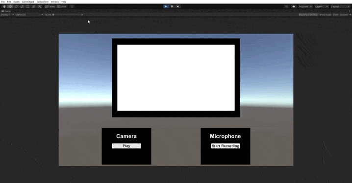

# P4 - Introducción a los Scrips en Unity
* **Asignatura:** Interfaces Inteligentes
* **Autor:** Marta Julia González Padrón
* **Correo:** alu0101254487@ull.edu.es

## Enunciado Práctica

El objetivo de esta práctica es aplicar las interfaces naturales en componentes con
Unity3D. Los componentes que se van a ver en esta práctica son la cámara y el micrófono del
ordenador o el teléfono móvil. 

## Micrófono

Primero se ha añadido un GameObject de tipo *Audio Source* para poder almacenar el ruido captado de nuestro microfono. A este le añadimos un Script en C# con funcionalidades de empezar y terminar grabación como la de reproducir el audio grabado. Además al microfono se le ha asignado dos botones. Uno que al clicar tiene dos opciones: si se esta grabando un audio termina la grabación y si no comienza una. El texto del botón tambien varía según el comportamiento disponible.
Cuando terminamos de grabar un audio, aparece el segundo botón que nos permite reproducir el audio. Cuando se esta reproduciendo el texto del botón cambiará de *Play* a *Playing* y volverá a su texto original una vez la grabación haya terminado.

[Prueba del Audio](https://drive.google.com/file/d/1h4uuIgvZQxj4Tkatq-XUnsmgkJiqV4gM/view?usp=sharing)

### Interactuar con los botones

Interactuar con los botones es muy sencillo.

```csharp
StartStopButton.onClick.AddListener(StartStopClicked);
```

Como se puede ver en el codigo, el objeto *StartStopButton* hace referencia al botón con el que interactuaremos, que fue creado en la UI de Unity. Se hace uso de la función `onClick` que detecta cuando el botón ha sido presionado. Despues se le pasa la función `AddListener` para poder añadir una funcion como *callback* que usaremos para saber como debe actual el micrófono.

### Grabar y para grabación

```csharp
public void StartStopClicked() {
  string microName = Microphone.devices[0];
  if (Microphone.IsRecording(microName)) {
    stopRecordingTime = Time.time;
    Microphone.End(microName);
    StartStopButtonText.text = "Start Recording";
    PlayButton.gameObject.SetActive(true);
  } else {
    startRecordingTime = Time.time;
    Mic.clip = Microphone.Start(microName, true, 10, 44100);
    StartStopButtonText.text = "Stop Recording";
    PlayButton.gameObject.SetActive(false);
  }
}
```

Como se aprecia en la funcion simplemente se hace uso de las funciones que nos proporciona la clase *Microphone*. Cabe destacar que se usan las variables **stopRecordingTime** y **startRecordingTime** para poder determinar la duración del audio y asi poder controlar cuanto tiempo sale el texto *Playing* sobre el botón. Tambien cabe destacar que se ha usado la función `SetActive(bool)` para ocultar/visibilizar el botón de reproducción de audio.

Para manipular el botón de reproducción se ha implementado el siguiente código:

```csharp
public void PlayClicked() {
  Mic.Play();
  StartCoroutine(PlayingText());
}

IEnumerator PlayingText() {
  PlayButtonText.text = "Playing"; 
  yield return new WaitForSeconds(stopRecordingTime - startRecordingTime);
  PlayButtonText.text = "Play"; 
}
```

La función `PlayClicked()` se encarga de reproducir el audio y empezar una corrutina que determina cuantos segundos debe estar el texto *Playing* del botón de reproducción.


## Cámara

Para poder acceder a la camara, hemos creado una estructura similar. Primero creamos un *RawImage* para poder visualizar el video y nuevamente creamos dos botones. Uno para empezar y detener la cámara y otro para poder Pausar y volver a reanudar la reproducción. El proceso de interacción con los botones se ha realizado de la misma manera que con el micrófono.

### Reproducción y detención del video

```csharp
public void StartStopClicked() {
  if (webCam != null) {
    display.texture = null;
    webCam.Stop();
    webCam = null;
    StartStopButtonText.text = "Play";
    PlayPauseButton.gameObject.SetActive(false);
  } else {
    webCam = new WebCamTexture(WebCamTexture.devices[0].name);
    display.texture = webCam;
    webCam.Play();
    StartStopButtonText.text = "Stop";
    PlayPauseButton.gameObject.SetActive(true);
    PlayPauseButtonText.text = "Pause";
  }
}
```

A diferencia de en el apartado anterior aqui comprobamos si nuestro *WebCamTexture*, que es quien tiene acceso a nuestra cámara, esta vacío o no. Si lo está pues le daos acceso a nuestra cámara, se lo asignamos a la textura de nuestro *RawImage*, comienza la reproducción usando la función `Play` se muestra el botón para pausar la reproducción y se modifica el texto de los botones. Si el *WebCamTexture* no esta vacio, entonces igualamos la textura del *RawImage* y nuestro *WebCamTexture* a **null** y como en la otra opción cambiamos los textos y dejamos de visualizar el otro botón.

### Pausar y volver a reproducir el video

Esta parte del código es bastante sencilla ya que se respalda en las fuciones que ya existen dentro del *WebCamTexture* como `isPlaying`, `Pause` y nuevamente `Play`.

```csharp
public void PlayPauseClicked() {
  if (webCam.isPlaying) {
    webCam.Pause();
    PlayPauseButtonText.text = "Play";
  } else {
    webCam.Play();
    PlayPauseButtonText.text = "Pause";
  }
}
```

Demostración de la cámara:



## Demostración de Camara + Micrófono

[Video Demostrativo](https://drive.google.com/file/d/183XfNJc7JTmw3FHBDDDQ1F0h4oz7raEB/view?usp=sharing)

